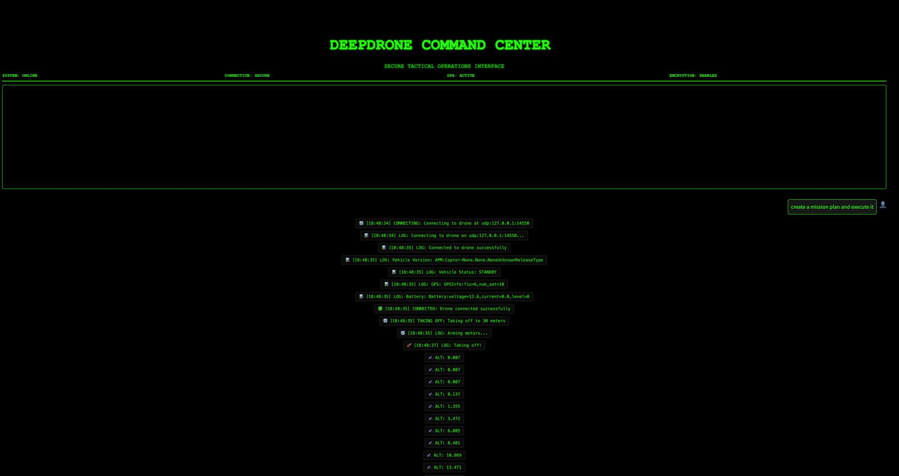
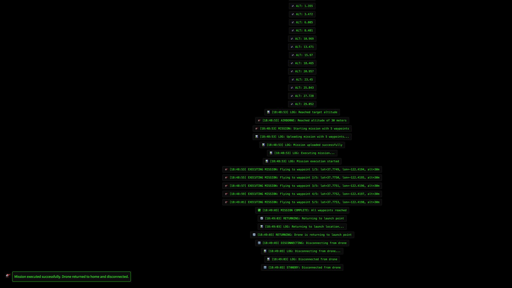

<div align="center">
  
  
</div>

# DeepDrone

A drone chat agent for drone analytics and operations, built on the smolagents framework with DroneKit integration for real drone control. It uses the GLM-4.5 API for natural language understanding and mission generation.

## Features

- **Drone Chat**: Interact with a drone assistant through a chat interface powered by GLM-4.5.
- **Visualizations**: Generate flight paths and sensor readings visualizations.
- **Maintenance Recommendations**: Get maintenance suggestions based on flight hours.
- **Mission Planning**: Generate mission plans for various drone operations.
- **Real Drone Control**: Connect to and control real drones using DroneKit.
  - Take off and land
  - Navigate to GPS coordinates
  - Return to home
  - Execute waypoint missions
  - Monitor battery and location

## Getting Started

1.  **Clone the repository**:
    ```bash
    git clone https://github.com/LeaderOnePro/deepdrone.git
    cd deepdrone
    ```
2.  **Install dependencies**:
    ```bash
    pip install -r requirements.txt
    ```
3.  **Python 3.10+ Compatibility**:
    If you're using Python 3.10 or newer, you need to run the patch script before using DroneKit:
    ```bash
    python dronekit_patch.py
    ```
    This script fixes the "AttributeError: module 'collections' has no attribute 'MutableMapping'" error by patching the DroneKit library to use collections.abc instead of collections.
4.  **Set up your API Key**:
    Create a file named `.env` in the root of the project and add your GLM API key:
    ```
    GLM_API_KEY=your_glm_api_key
    ```
5.  **Run the application**:
    ```bash
    streamlit run main.py
    ```

## Using DroneKit Integration

The DroneKit integration allows you to control drones running ArduPilot or PX4 firmware.

### Simulation

To test the drone control features in a simulated environment:

1.  Install the ArduPilot SITL simulator (follow instructions at the [ArduPilot dev guide](https://ardupilot.org/dev/docs/setting-up-sitl-on-linux.html)).
2.  Start a simulated drone: `sim_vehicle.py -v ArduCopter --console --map`
3.  Connect to the simulator from the DeepDrone chat interface by typing: `Connect to simulator at tcp:127.0.0.1:5762` or `connect_to_real_drone('tcp:127.0.0.1:5762')`.

### Real Drone Connection

To connect to a real drone, you can either use the chat interface within the application or a command-line script to test your connection first.

#### Via Chat Interface

1.  Ensure your drone is running ArduPilot or PX4 firmware.
2.  Connect your drone to your computer.
3.  Use natural language commands in the DeepDrone chat interface. For example:
    - "Connect to drone at `tcp:192.168.1.1:5760`"
    - "Connect to drone using USB at `/dev/ttyACM0`" (for Linux)
    - "Connect to the drone at `COM4`" (for Windows)

#### Via Terminal (for Connection Testing)

Before using the main application, you can test your hardware connection using the `connection_test.py` script. This is useful for verifying that your drone is communicating correctly with your computer.

Run the script from your terminal, providing the appropriate connection string.

```bash
# For direct USB connection
python connection_test.py /dev/ttyACM0  # Linux
python connection_test.py COM5         # Windows

# For WiFi/Network connection
python connection_test.py tcp:192.168.1.1:5760

# For telemetry radio connection
python connection_test.py /dev/ttyUSB0
```

The script will attempt to connect and print the drone's status and attributes if successful.

Once connected, you can control the drone with commands like:
- "Take off to 10 meters"
- "Fly to latitude 37.7749, longitude -122.4194, altitude 30 meters"
- "Return to home"
- "Land now"

### Troubleshooting

-   **`collections.MutableMapping` error**: If you encounter this error, especially on Python 3.10+, run the included patch script: `python dronekit_patch.py`. This script resolves a compatibility issue in the DroneKit library.
-   **Connection refused error**: Ensure the drone or simulator is powered on and the connection string is correct.
-   **Import errors**: Verify that all dependencies are installed by running `pip install -r requirements.txt`.
-   **Permission errors**: For USB connections on Linux, you may need to add your user to the `dialout` group (`sudo usermod -a -G dialout $USER`) or use `sudo` to run the application.

**IMPORTANT**: Always follow safety guidelines when operating real drones.

## Tech Stack

-   **smolagents** for agent functionality.
-   **GLM-4.5 API** (`glm-4.5` model) for natural language understanding and code generation.
-   **DroneKit-Python** for real drone control.
-   **Streamlit** for the user interface.
-   **Pandas, Matplotlib, and Seaborn** for data analysis and visualization.
